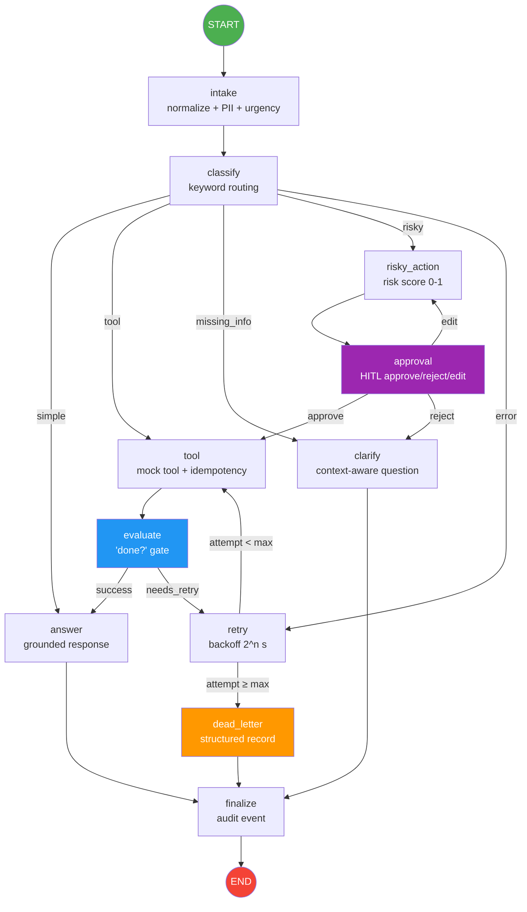

```mermaid
graph TD
    START((START)) --> intake
    intake["intake<br/>normalize + PII + urgency"] --> classify

    classify["classify<br/>keyword routing"] -->|simple| answer
    classify -->|tool| tool
    classify -->|missing_info| clarify
    classify -->|risky| risky_action
    classify -->|error| retry

    tool["tool<br/>mock tool + idempotency"] --> evaluate
    evaluate["evaluate<br/>'done?' gate"] -->|success| answer
    evaluate -->|needs_retry| retry

    retry["retry<br/>backoff 2^n s"] -->|attempt &lt; max| tool
    retry -->|attempt ≥ max| dead_letter

    risky_action["risky_action<br/>risk score 0-1"] --> approval
    approval["approval<br/>HITL approve/reject/edit"] -->|approve| tool
    approval -->|reject| clarify
    approval -->|edit| risky_action

    clarify["clarify<br/>context-aware question"] --> finalize
    answer["answer<br/>grounded response"] --> finalize
    dead_letter["dead_letter<br/>structured record"] --> finalize

    finalize["finalize<br/>audit event"] --> END((END))

    style START fill:#4CAF50,color:#fff
    style END fill:#f44336,color:#fff
    style dead_letter fill:#ff9800,color:#fff
    style approval fill:#9c27b0,color:#fff
    style evaluate fill:#2196F3,color:#fff
```
